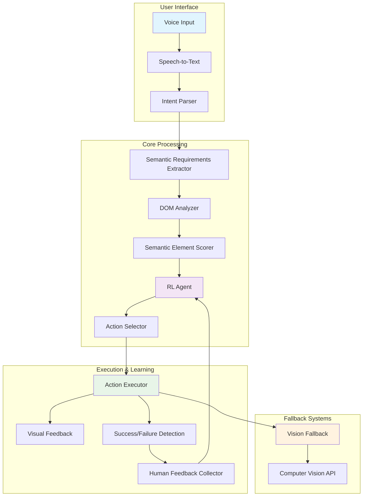
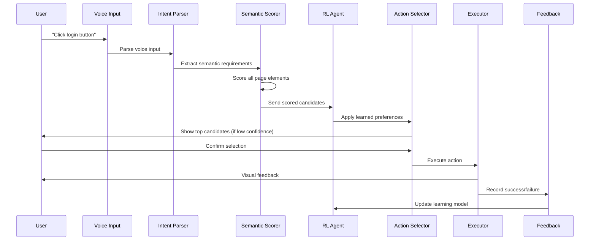
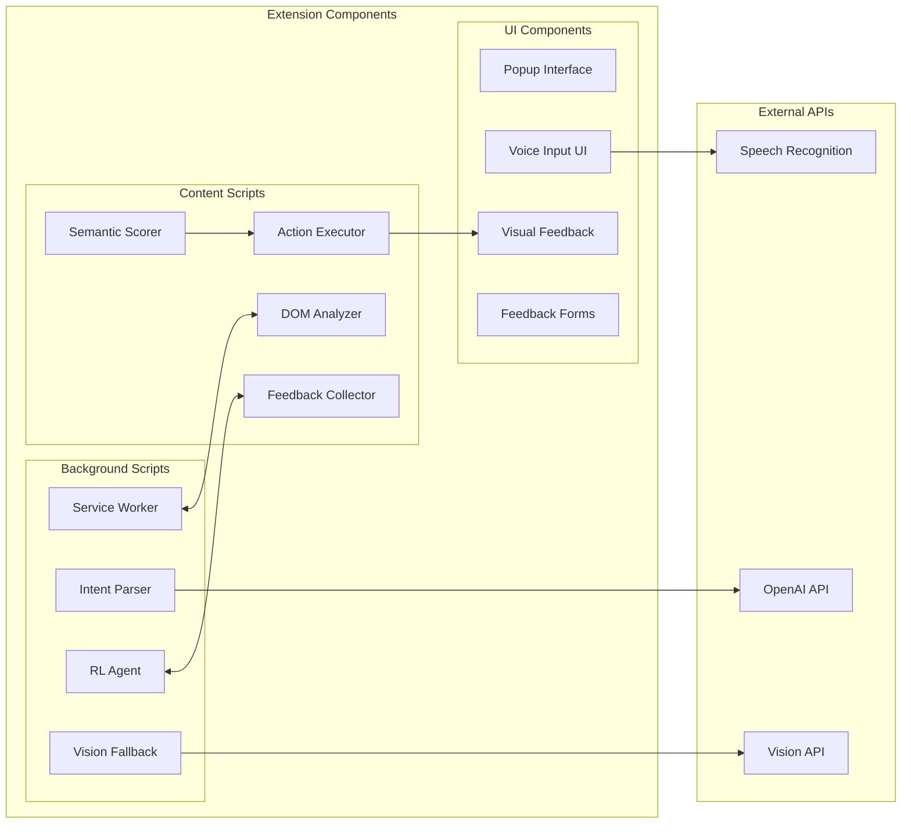
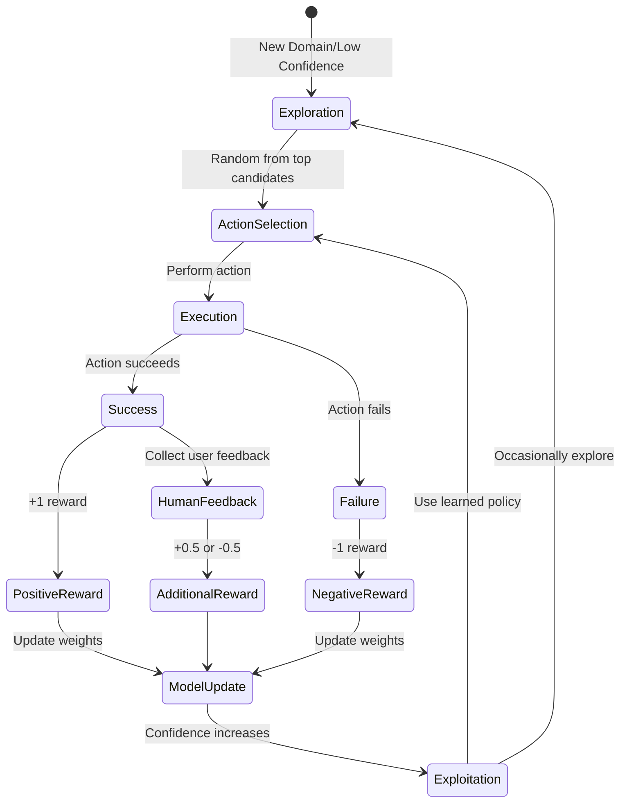
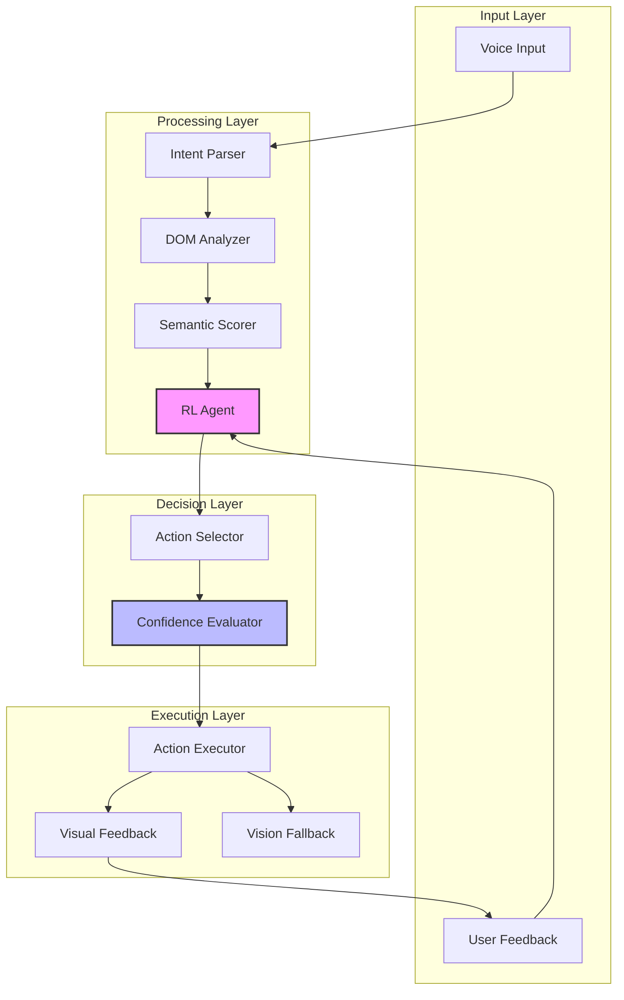
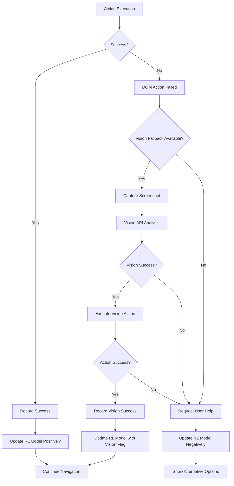

# Navis Project Diagrams

## 1. High-Level System Architecture



## 2. Data Flow Diagram



## 3. Chrome Extension Architecture



## 4. Semantic Scoring Process

```mermaid
flowchart TD
    A[User Intent: "Click login button"] --> B[Extract Keywords: login, sign in, authenticate]
    B --> C[Scan DOM Elements]
    C --> D{For Each Element}
    
    D --> E[Text Match Score]
    D --> F[Semantic Relevance Score]
    D --> G[Context Position Score]
    D --> H[Visual Prominence Score]
    D --> I[Historical Success Score]
    
    E --> J[Weighted Combination]
    F --> J
    G --> J
    H --> J
    I --> J
    
    J --> K[Total Confidence Score]
    K --> L{Confidence > 0.7?}
    
    L -->|Yes| M[Execute Action]
    L -->|No| N[Show Top 3 Candidates to User]
    N --> O[User Selection]
    O --> M
    
    M --> P[Record Success/Failure]
    P --> Q[Update RL Model]
```

## 5. Reinforcement Learning Flow



## 6. Component Interaction Matrix



## 7. Error Handling & Fallback Strategy

